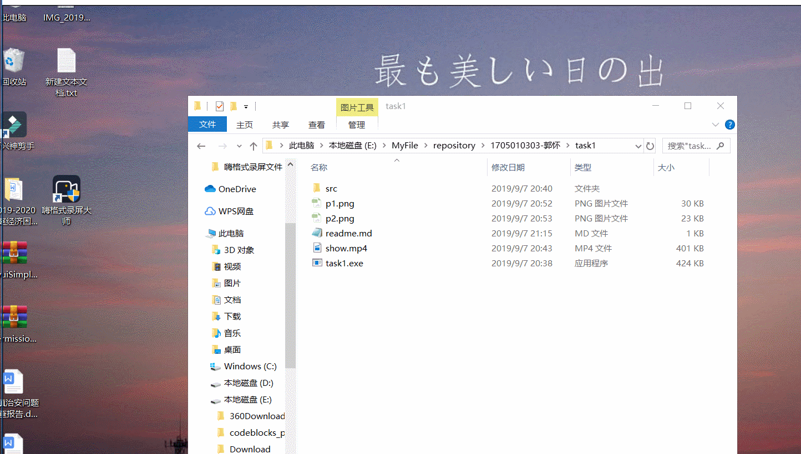
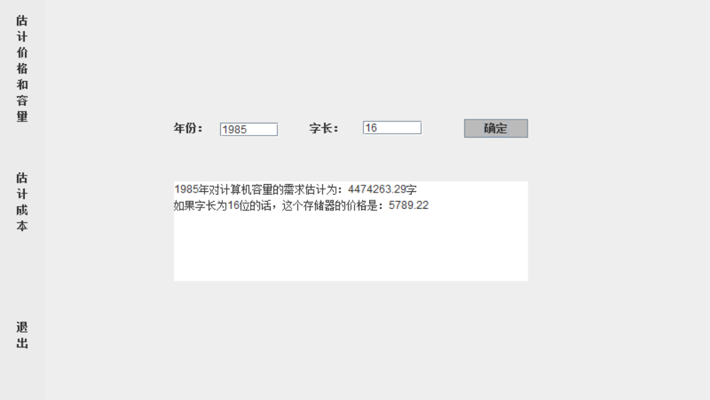

# 开发工具和语言

开发工具：eclipse
语言：Java

# 运行环境

windows 64位

# 源文件说明

由于此程序比较简单，所以写了一个类（p包下面的Main.java）。

# 功能描述

gif演示：

1. **估计容量和价格**

点击“估计容量和价格”选项卡，在界面中输入年份和字长，然后点击确认按钮即可得出容量和价格的估计值。

如图：

2. **估计成本**

点击“估计成本”选项卡，在界面中输入年份、一位程序员一天开发的指令条数和程序员每个月的工资，然后点击确认按钮即可得出成本的估计值。

如图：

3. **退出**

点击“退出”选项卡，即可退出程序。
