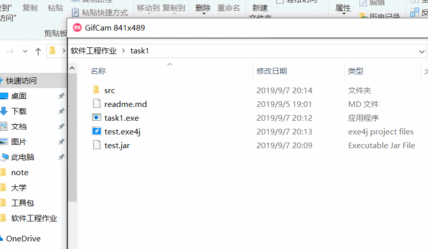

# 软件工程task1
## 1、开发工具及语言
#### &nbsp;&nbsp;&nbsp;&nbsp;开发工具：eclipse
#### &nbsp;&nbsp;&nbsp;&nbsp;开发语言：Java
## 2、运行环境
#### &nbsp;&nbsp;&nbsp;&nbsp;目前在Windows10 64位下正常运行，其他未经测试
## 3、功能描述
#### &nbsp;&nbsp;&nbsp;&nbsp;改程序是软件工程导论一书P22页题5的程序实现，可以实现一定模拟计算功能，比如计算机存储容量计算、存储器价格计算以及编写一定代码量的程序成本计算。
## 4、源文件说明
#### &nbsp;&nbsp;&nbsp;&nbsp;1. se.task1为该源文件的程序包
#### &nbsp;&nbsp;&nbsp;&nbsp;2. Function.java为实现该程序的功能文件
#### &nbsp;&nbsp;&nbsp;&nbsp;3. Layout.java为该程序的UI布局文件
#### &nbsp;&nbsp;&nbsp;&nbsp;4. Main.java为该程序的程序入口文件
### 附：程序运行动态演示+Function.java

```java
public class Function {
	/**
	 * 获取在某年所对应存储容量的需求
	 * @param year
	 * @return
	 */
	public static double getNeedMemerySize(int year) {
		double memerySize;
		memerySize = 4080*Math.pow(Math.E, 0.28*(year-1960));
		System.out.println("NeedMemerySize : "+memerySize);
//		return Math.ceil(memerySize);
		return memerySize;
	}
	
	/**
	 * 对应年限和机器字长的存储器容量价格估计
	 * @param year
	 * @param wordLen	机器字长
	 * @return
	 */
	public static double getMemeryPrice(int year,int wordLen) {
		double result;
		if(wordLen == 16) {
			result = 0.048*Math.pow(0.72, (year-1974))*getNeedMemerySize(year);
		}else {
			result = 0.003*wordLen*Math.pow(0.72, (year-1974))*getNeedMemerySize(year);
		}
		return result;
	}
	
	/**
	 * 对雇佣程序员编写程序的成本估算
	 * @param year	所处公元某年
	 * @param num	每日编写程序的指令数
	 * @param wage	程序员每月薪资
	 * @param days	程序员每月工作天数
	 * @return	返回成本
	 */
	public static double getAllPrice(int year,int num,int wage,int days) {
		return getNeedMemerySize(year)/(num*days)*wage;
	}
}
```