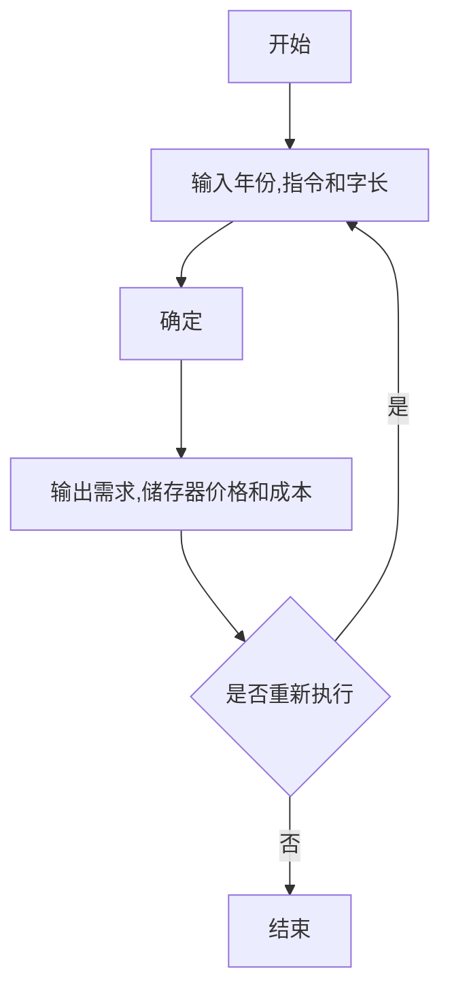

#                         小程序开发 #

## 1.开发工具和语言 ##

 	本次开发使用了eclipse开发工具通过使用python语句进行开发。

## 2.运行环境 ##

  	本次实验的运行环境为Windows python3.7 

## 3.功能描述 ##



当要计算需求，存储器价格和成本时，输入年份，字长和指令后程序将自动运行得出结果，当需要再次运行时可以将原来的数据删除从而得到新的结果。

## 4.源代码文件说明 ##

```python
from tkinter import *
from loginpage import * 

root = Tk() 
root.title('小程序') 
LoginPage(root)
root.mainloop() 
```

这是main函数的代码通过TK（）函数创建总窗口 ，应用自制模块的LoginPage函数从而进入下一个窗口

```python
from tkinter import *
from MainPage1 import *

class LoginPage(object): 
    def __init__(self, master=None): 
        self.root = master
        self.root.geometry('%dx%d' % (200,180))
        self.createPage()
        
    def createPage(self):
        self.page = Frame(self.root)  
        self.page.pack()
        Button(self.page, text='第题',command=self.loginCheck).grid(row=1, stick=W, pady=10)
        
    def loginCheck(self):
        self.page.destroy()
        MainPage(self.root)

```

这是一个子页面可以选择第一题的按钮从而进入第一题的界面。

```python
from tkinter import *
import math

class MainPage(object):
    def __init__(self, master=None):
        self.root = master #定义内部变量root 
        self.root.geometry('%dx%d' % (300, 250)) #设置窗口大小 
        self.year = IntVar() 
        self.date = IntVar()
        self.instruction=IntVar()
        self.salary=IntVar() 
        self.createPage() 
     
    def createPage(self):
        self.page = Frame(self.root) #创建Frame 
        self.page.pack() 
        Label(self.page,text="年份：").grid(row=0,column=0)
        Label(self.page,text="字长：").grid(row=1,column=0)
        Label(self.page,text="指令：").grid(row=2,column=0)
        Label(self.page,text="工资（美元）：").grid(row=3,column=0)
        Label(self.page,text="需求（字）：").grid(row=4,column=0)
        Label(self.page,text="储存器价格（美元）：").grid(row=5,column=0)
        Label(self.page,text="成本（美元）：").grid(row=6,column=0)
        
        self.e1=Entry(self.page,textvariable=self.year)
        self.e2=Entry(self.page,textvariable=self.date)
        self.e3=Entry(self.page,textvariable=self.instruction)
        self.e4=Entry(self.page,textvariable=self.salary)
        self.e5=Entry(self.page)
        self.e6=Entry(self.page)
        self.e7=Entry(self.page)
        self.e1.grid(row=0,column=1,padx=10,pady=5)
        self.e2.grid(row=1,column=1,padx=10,pady=5)
        self.e3.grid(row=2,column=1,padx=10,pady=5)
        self.e4.grid(row=3,column=1,padx=10,pady=5)
        self.e5.grid(row=4,column=1,padx=10,pady=5)
        self.e6.grid(row=5,column=1,padx=10,pady=5)
        self.e7.grid(row=6,column=1,padx=10,pady=5)
        Button(self.page,text="确定",width=10,command=self.show).grid(row=7,column=0,sticky=W)
        Button(self.page,text="退出",width=10,command=self.page.quit).grid(row=7,column=1,sticky=E)
    def show(self):
        a=self.year.get()
        b=self.date.get()
        e=self.instruction.get()
        f=self.salary.get()
        c=math.exp(0.28*(a-1960))*4080
        c1=round(c,2)
        d=0.003*b*0.72**(a-1974)*c
        d1=round(d,2)
        g=(f/(e*30))*c1
        g1=round(g,2)
        self.e5.insert(0,c1)
        self.e6.insert(0,d1)
        self.e7.insert(0,g1)


```

这是第一题的界面主要功能是计算需求，存储器价格和成本时，输入年份，字长和指令后程序将自动运行得出结果，当需要再次运行时可以将原来的数据删除从而得到新的结果。有三个函数分别是__init__，createPage和show函数用于页面的gui设计和后台的函数引用。