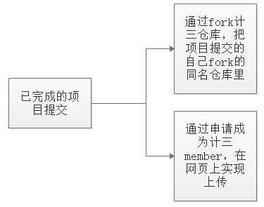

# se_task
## 17软件工程课各班GitHub仓库网址
[计一](https://github.com/JiSanSET/ "计一")&nbsp;&nbsp;&nbsp;[计二](https://gitee.com/zhang_baowang/17_to_2 "计二")&nbsp;&nbsp;&nbsp; [计三](https://github.com/JiSanSET/ "计三")&nbsp;&nbsp;&nbsp;[物一](https://github.com/JiSanSET/ "物一") &nbsp;&nbsp;&nbsp;[物二](https://github.com/JiSanSET/ "物二")

## 作业提交说明
软件工程作业要求：
1. 建立src文件夹，里面包含主类文件、界面文件、功能文件、样式文件、配置文件以及所需的jar包等，但是千万不要把运行环境也上传了
2. 生成exe等可执行文件等
3. 制作GIF动态演示文件（可以用短视频替代，格式为常用的，如MP4）
4. 编写readme.md程序说明文件
5. 编写需求分析文档（第一周的作业不用写）

README.md文档内容包括：
1. 开发工具，开发语言
2. 运行环境
3. 功能描述
4. 源文件说明
5. 关键代码说明
###### 上述内容可以适当作补充

- 以上是两种提交方式，选择其一即可
- 注意！请不要用git命令提交自己的项目到计三的仓库里哦
- 另外，同学们生成的EXE文件最好在其他人的电脑上看看能否正常运行，防止老师运行该程序时出错。如果在其他电脑上出错，检查在jar转EXE过程中哪些配置是否有问题。
- 还有，不要往GitHub上上传各种运行环境，最后能够运行的要么是 EXE等可执行类 文件，要么就是通过常用的第三方软件可以打开的比如网页，如果你能打包成安装文件也是可以的，比如apk，EXE等安装包文件，但是确保能够在普遍的机器上运行
